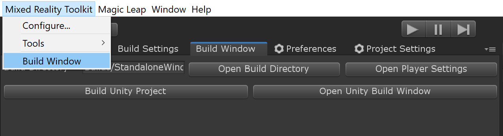

# Getting started with the Mixed Reality Toolkit

The Mixed Reality Toolkit's primary focus is to make it extremely easy to get started creating Mixed Reality applications and to accelerate deployment to multiple platforms from the same Unity project.

<a href="https://medium.com/@stephen_hodgson/the-mixed-reality-framework-6fdb5c11feb2">](https://miro.medium.com/max/11666/1*JSU5Me8i2GUHcmbiUTsrlw.jpeg)</a>
> [More information about the architecture and design of the Mixed Reality Toolkit](https://medium.com/@stephen_hodgson/the-mixed-reality-framework-6fdb5c11feb2)

## Prerequisites

To get started with the Mixed Reality Toolkit you will need:

* [Visual Studio 2019+ (Community or full)](https://visualstudio.microsoft.com/downloads/)
* [Unity 2019.3+](https://unity3d.com/get-unity/download/archive)
* [Latest XRTK release](https://github.com/XRTK/XRTK-Core/releases)

> **Note:** Specific platforms may have additional platform requirements. It's best to check that platform's readme for more information.

> **Note:** Currently, the Scriptable Render Pipeline is not yet supported, so the LWSRP, HDSRP and VRSRP workflows not compatible.  Please stay tuned to the GitHub site for future announcements on SRP support.

## Setting up the Environment

If you're using a Windows OS for development, then you'll need to enable Developer Mode in the operating system settings.

> **Tip:** You can quickly find the Developer Settings by pressing `win + S` and type “Developer Settings”.

## Starting a new Mixed Reality project

One of the Mixed Reality Toolkit's primary goals was to ensure new projects can get up and running as fast as possible. To this end, the default configuration ensures you can simply import, play and run a new project right out of the box.

---

### Adding the Mixed Reality Toolkit to your project

The Mixed Reality Toolkit is available via [multiple delivery mechanisms](01-DownloadingTheXRTK.md), primarily via the Unity Package Management system.

Our preferred deployment approach is to fully utilize [Unity's native package manager](https://docs.unity3d.com/Manual/upm-ui.html) to incorporate the Mixed Reality Toolkit in your solution, akin to the other modules Unity provides out of the box.  This is the quickest and safest way to get Mixed Reality Toolkit in your solution and is automatically updated as new releases are published.

> **Note:** Some prefabs and assets require TextMesh Pro, meaning you have to have the TextMesh Pro package installed and the assets in your project `Window -> TextMeshPro -> Import TMP Essential Resources`.

Simply follow along with the UPM Installation instructions detailed in the [Downloading the XRTK](01-DownloadingTheXRTK.md#register_upm_server_in_project_settings) guide to add the XRTK scoped registry and install the relevant packages.

> We recommend installing the **SDK** first to ensure you have the smoothest setup with the XRTK and give you access to the Quickstart configurations.

---

### Configure your base scene

The Mixed Reality Toolkit has been designed so that there is a base scene with all of the required GameObjects.  This base scene provides support for the core configuration and runtime.

> **Note:** As more scenes are required in your project you'll need to [addatively load](https://docs.unity3d.com/ScriptReference/SceneManagement.LoadSceneMode.Additive.html) and unload each individually at runtime while keeping the configured base scene loaded at all times.

Configuring your scene is extremely simple by simply selecting the following from the Editor menu:

> `Mixed Reality Toolkit -> Configure...`

Configuring the toolkit will set up the camera rig, creates the `MixedRealityToolkit`, and adds additional components to the `Main Camera`. Once this completes, you will see the following in your project's scene hierarchy:

Which contains the following:

* `MixedRealityToolkit` - The toolkit object itself, providing the main entry point for the framework into the Unity event loop. This object references a `Configuration Profile` which defines all the settings and customizable options for your application.
* `MixedRealityPlayspace` - The parent object for the camera rig, which ensures the headset, controllers, and other spatially tracked objects are positioned correctly in the scene relative to the player's local frame of reference.
  * The `Main Camera` is moved to be a child to the `MixedRealityPlayspace`, Which allows the playspace to move the whole camera rig without interfering with any camera driven movement from the native SDKs.
  * The `PlayerBody` is positioned at the same x/z position as the `Main Camera`, but placed at the player's feet. Rotation of the body doesn't always match the `Main Camera`'s rotation, but is an approximation of the player's body rotation.

> **Warning!** While working on your scene in the editor, **DON'T** move the Main Camera or the Playspace from the scene origin (0,0,0).  This is controlled by the Mixed Reality Toolkit and the active platform's `Camera Data Provider`, and most platforms expect the camera to start at this location.
>
> If you need to move the player's start point, then either:
>
> 1. Move the scene content and NOT the camera.
> 2. Move the Playspace after the scene has started.

From here your project should be ready to build and play on the platform you're targeting, or you can take an [in depth look on configuring your project](02-Configuration.md#configuring-your-project) to your specific requirements.

---

### Build and Play

You are now ready to start building your Mixed Reality Solution, just start adding content and get building!

Open the Unity Build settings, and switch to the target platform you wish to build on.

> **Note:** Depending on the platform's simulation support, you should be able to run in the editor by pressing play.

Once satasfied, you can build your project by using the Mixed Reality Toolkit's Build window:

Once the build completes, you can install and run it on the device.

> **Note:** The build window automatically installs some platforms for you, but depending on the platform, you'll need to follow the platform specific installation steps to get it manually installed on your device.

---

### Related Articles

* [Downloading the XRTK](01-DownloadingTheXRTK.md)
* [Configuring your project](02-Configuration.md)
* [Known Issues](04-KnownIssues.md)

---

### [**Raise an Information Request**](https://github.com/XRTK/XRTK-Core/issues/new?assignees=&labels=question&template=request_for_information.md&title=)

If there is anything not mentioned in this document or you simply want to know more, raise an [RFI (Request for Information) request here](https://github.com/XRTK/XRTK-Core/issues/new?assignees=&labels=question&template=request_for_information.md&title=).
