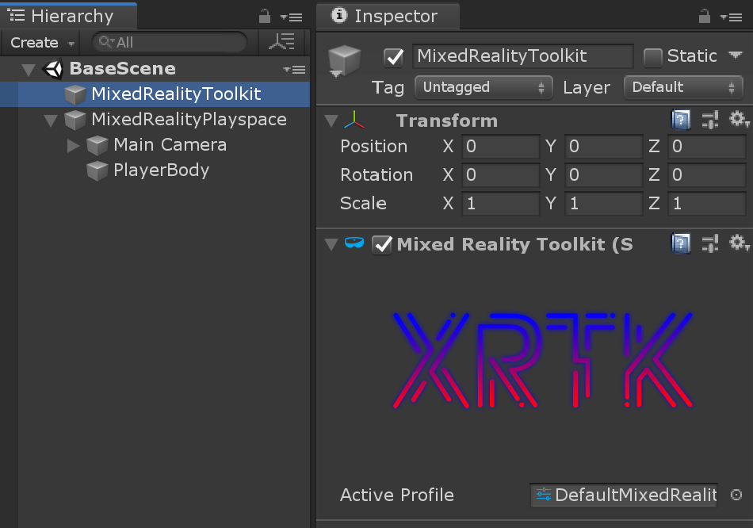
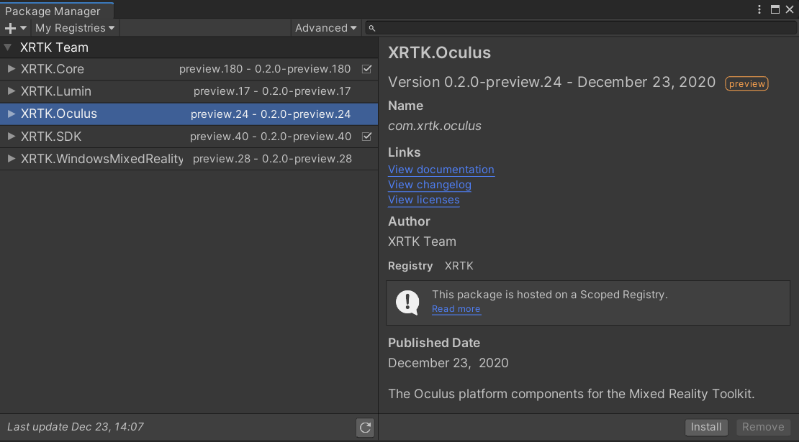
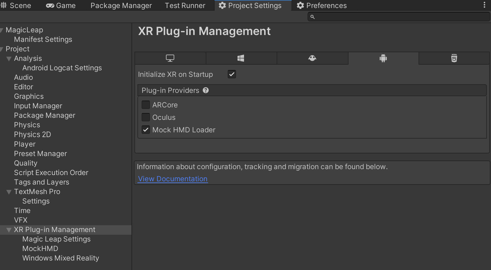

# Getting started with the Mixed Reality Toolkit

The Mixed Reality Toolkit's primary focus is to make it extremely easy to get started creating Mixed Reality applications and to accelerate deployment to multiple platforms from the same Unity project.

The goal of the Mixed Reality Toolkit is to enable developers to build a single project for multiple platforms, building for each platform from Unity as required without all the normal complexities of handling different XR SDKs.

<a href="https://medium.com/@stephen_hodgson/the-mixed-reality-framework-6fdb5c11feb2">](https://miro.medium.com/max/11666/1*JSU5Me8i2GUHcmbiUTsrlw.jpeg)</a>
> [More information about the architecture and design of the Mixed Reality Toolkit](https://medium.com/@stephen_hodgson/the-mixed-reality-framework-6fdb5c11feb2)

## Contents

* [Prerequisites](#prerequisites)
* [Adding XRTK to your project](#adding-the-mixed-reality-toolkit-to-your-project)
* [Creating your first Mixed Reality Scene](#configure-your-base-scene)
* [Adding additional Platforms](#adding-additional-platforms)
* [Build and Play](#build-and-play)

One of the Mixed Reality Toolkit's primary goals was to ensure new projects can get up and running as fast as possible. To this end, the default configuration supplied in the toolkit SDK ensures you can simply import, play and run a new project right out of the box.

## Prerequisites

To get started with the Mixed Reality Toolkit you will need:

* [Visual Studio 2019+ (Community or full)](https://visualstudio.microsoft.com/downloads/)
* [Unity 2019.4+ LTS](https://unity3d.com/get-unity/download/archive)
* [Latest XRTK release](01-DownloadingTheXRTK.md)

> **Note:** Specific platforms may have additional platform requirements. It's best to check that platform's readme for more information.

> **Note:** Currently, the Scriptable Render Pipeline is not yet supported, so the LWSRP, HDSRP and VRSRP workflows not compatible.  Please stay tuned to the GitHub site for future announcements on SRP support.

### Setting up a Windows Environment

If you're using a Windows OS for development, then you'll need to enable Developer Mode in the operating system settings.

> **Tip:** You can quickly find the Developer Settings by pressing `win + S` and type “Developer Settings”.

### Setting up a MAC Environment

When developing for XRTK on a Mac, you simply need the default requirements needed for building any Unity project on a Mac, including (but not limited to):

* Unity
* XCode - For Mac/iOS builds
* Android SDK/NDK - For Android builds

---

## Adding the Mixed Reality Toolkit to your project

First download the Mixed Reality Toolkit via one of the [delivery mechanisms](01-DownloadingTheXRTK.md) into your Unity project.

Our preferred deployment approach is to install using the [Unity Package Manager](01-DownloadingTheXRTK.md#register-upm-server-in-project-settings).  This is the quickest and safest way to get Mixed Reality Toolkit in your solution and provides new releases as soon as they are published. Using UPM, there are also no asset conflicts in your Unity project.

> **Note:** Some prefabs and assets require TextMesh Pro, meaning you have to have the TextMesh Pro package installed and the assets in your project `Window -> TextMeshPro -> Import TMP Essential Resources`.

### It all starts with the SDK

We recommend installing the **XRTK.SDK** first to ensure you have the smoothest setup with the XRTK, which also gives you access to the Quickstart configurations.

---

## Configure your base scene

The Mixed Reality Toolkit has been designed so that there is a base scene with all of the required GameObjects.  This base scene provides support for the core configuration and runtime.

> **Note:** As more scenes are required in your project you'll need to [additively load](https://docs.unity3d.com/ScriptReference/SceneManagement.LoadSceneMode.Additive.html) and unload each individually at runtime while keeping the configured base scene loaded at all times.

Configuring your scene is extremely simple by simply selecting the following from the Editor menu:

> `Mixed Reality Toolkit -> Configure...`

Configuring the toolkit will set up the camera rig, creates the `MixedRealityToolkit`, and adds additional components to the `Main Camera`. Once this completes, you will see the following in your project's scene hierarchy:

Which contains the following:

* `MixedRealityToolkit` - The toolkit object itself, providing the main entry point for the framework into the Unity event loop. This object references a `Configuration Profile` which defines all the settings and customizable options for your application.
* `MixedRealityPlayspace` - The parent object for the camera rig, which ensures the headset, controllers, and other spatially tracked objects are positioned correctly in the scene relative to the player's local frame of reference.
  * The `Main Camera` is moved to be a child to the `MixedRealityPlayspace`, Which allows the playspace to move the whole camera rig without interfering with any camera driven movement from the native SDKs.
  * The `PlayerBody` is positioned at the same x/z position as the `Main Camera`, but placed at the player's feet. Rotation of the body doesn't always match the `Main Camera`'s rotation, but is an approximation of the player's body rotation.

> **Warning!** While working on your scene in the editor, **DO NOT** move the Main Camera or the Playspace from the scene origin (0,0,0).  This is controlled by the Mixed Reality Toolkit and the active platform's `Camera Data Provider`, and most platforms expect the camera to start at this location.
>
> If you need to move the player's start point, then either:
>
> 1. Move the scene content and NOT the camera.
> 2. Move the Playspace after the scene has started.

From here your project should be ready to build and play on the platform you are targeting, or you can take an [in depth look on configuring your project](02-Configuration.md#configuring-your-project) for any specific requirements.

From here, you can install any additional platforms you need to deploy to other platforms.

---

## Adding additional Platforms

Once you have your initial scene setup with the Unity Standalone platform, you are ready to install additional platforms to build and deploy to.

To add a new platform, simply return to the Unity Package Manager (`Window -> Package Manager`) and selecting `My Registries` from the source drop down, select the package to install (for example XRTK.WindowsMixedReality) and click Install as shown below:

Once installed, the default for that platform will be copied into the `XRTK.Generated` folder in your project assets and a prompt will appear to automatically register the platforms configuration with your scene, as shown below:

If you click `Later`, please refer to the [Configuration Guide](02-Configuration.md) for how to manually add the configuration

---

## Build and Play

You are now ready to start building your Mixed Reality Solution, just start adding content and get building!

You will need to enable the Unity XR SDK Loaders in the project settings to be able to launch the application in XR Mode for each respective platform.

> **Note:** Where possible use the Mock HMD Loader, as the XRTK already talks directly to the native apis. We only need the XR SDK display subsystems to get the XR Mode to correctly render to the screen.

Once you are ready to build, open the Unity Build settings, and switch to the target platform you wish to build on, then open the Mixed Reality Toolkit's build window and build from there.

> **Note:** Depending on the platform's simulation support, you should be able to run in the editor by pressing play.
>
> Please check the [FAQ](appendices/A04-FAQ.md) for any difficulties.

### Building for Windows Standalone (OpenVR/Oculus Rift-Link)

When targeting Windows Standalone there should be no special setup and the Mixed Reality Toolkit will work as configured. Builds should be able to target OpenVR and Oculus Quest (via Oculus Link).

Please ensure either the OpenVR or Oculus Camera and Controller providers are configured.

### Building for Windows Mixed Reality (UWP)

> See the [Windows Mixed Reality Platform](platforms/windowsmixedreality.md) documentation for more details on the platform.

### Building for Oculus Quest / Android

> See the [Oculus Platform](platforms/oculus.md) documentation for more details on the platform.

### Building for Magic Leap

> See the [Magic Leap Platform](platforms/magicleap.md) documentation for more details on the platform.

---

### Related Articles

* [Downloading the XRTK](01-DownloadingTheXRTK.md)
* [Configuring your project](02-Configuration.md)
* [Known Issues](04-KnownIssues.md)
* [Frequently Asked Questions](appendices/A04-FAQ.md)

---

### [**Raise an Information Request**](https://github.com/XRTK/XRTK-Core/issues/new?assignees=&labels=question&template=request_for_information.md&title=)

If there is anything not mentioned in this document or you simply want to know more, raise an [RFI (Request for Information) request here](https://github.com/XRTK/XRTK-Core/issues/new?assignees=&labels=question&template=request_for_information.md&title=).
