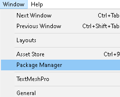
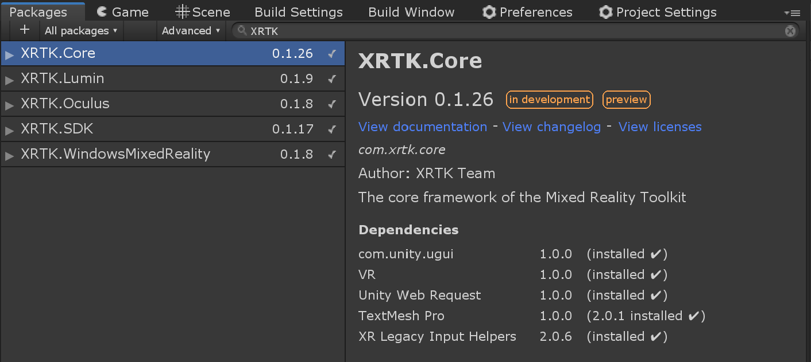

# How to download the Mixed Reality Toolkit

The Mixed Reality Toolkit provides many ways for users and developers to get access to the Mixed Reality Toolkit and the various extensions/platforms it supports.  These methods are tuned to use the common patterns most familiar to Unity developers, these include:

* [Automatic UPM installation](#automatic-upm-installation) - Registers the Mixed Reality Toolkit's upm server in Unity's Package Manager and automatically installs the XRTK-Core and SDK packages.

  > **Note:** developers are expected to [add the platform support](#install-platform-packages) they need by searching for the modules in the Unity Pacakge Manger.

* [Manual UPM installation](#manual-upm-installation) - Register the Mixed Reality Toolkit upm server in your manifest and manually download modules al la carte.

* [GIT Submodules](#git-submodules) - For advanced developers, simply clone the project into your solution and update its submodules to get access to all platforms.

In this article, we will walk through each approach to get you up and running, starting with the simplest first.

## Automatic UPM Installation

Our preferred deployment approach is to fully utilize [Unity's native package manager](https://docs.unity3d.com/Manual/upm-ui.html) to incorporate the Mixed Reality Toolkit in your solution, akin to the other modules Unity provides out of the box.  This is the quickest and safest way to get Mixed Reality Toolkit in your solution and is automatically updated as new releases are published.

Download the [XRTK-Core.unitypackage](https://github.com/XRTK/XRTK-Core/releases) asset, then drag and drop it into your project window.  This adds an Mixed Reality Toolkit seed, that will automatically registers the Mixed Reality Toolkit's upm server with the Unity package manager and starts the download and installation of the Core and SDK packages.


### Install platform packages

The Mixed Reality Toolkit doesn't automatically download all of the various platform support packages by default.  You'll need to add these additional packages via the Unity Package Manager via `Unity -> Windows -> Package Manager`.



Next, use the search box to filter out the platform specific packages your project needs by typing in `XRTK` to filter out all of the pacakges availible in scope.



## Manual UPM Installation

If you prefer to do things yourself, you can simply edit the ***manifest.json*** file in your Unity project and add an entry to register the Mixed Reality Toolkit and begin the download and installation into your project.

To locate the folder the manifest is in, simply right-click in your Unity project folder on the "Packages" folder as shown below, then select the "Show in Explorer" option:


In the packages folder, you will see the specific Manifest.json file which you will need to open for editing using your favorite tool ([We prefer VSCode as it's awesome](https://code.visualstudio.com/))

Inside the Manifest file, you will see all the packages Unity provides "out of the box" listed:

To this you simply need to add the extra entry for the Mixed Reality Toolkit as follows:

```json
{
  "scopedRegistries": [
    {
      "name": "XRTK",
      "url": "http://upm.xrtk.io:4873/",
      "scopes": [
        "com.xrtk"
      ]
    }
  ],
  "dependencies": {
    "com.xrtk.core": "XX.XX.XX",
    "com.xrtk.sdk": "XX.XX.XX",
    ...
  },
}
```

Once it's updated and you return to Unity, the packages will be refreshed and all the defined Mixed Reality Toolkit packages will be downloaded and imported.

## GIT Submodules

Advanced developers and those wishing to contribute to the Mixed Reality Toolkit also have the option to directly import and edit the framework in their live projects using GIT Submodules.

> **Note:** The XRTK-Core repository is setup to utilize this GIT Submodule workflow and is a great example of how to utilize this workflow.

1. Initialize your project's repository with the XRTK-Core submodule.
2. Checkout the **development** branch of the XRTK-Core submodule and make sure it's up to date and synced with any upstream changes.
3. Create Symbolic links for each package you wish to directly modify in your project by using the project window context menu
  
4. Using the symbolic link wizard, choose the source folder for the package you wish you replace with the editable version, and the target path for your project, then import the package.
  
    > **Note:** it's strongly advised to use the Packages as your target path for upm packages.
5. Repeat step 4 for each package you'd like to directly modify.

> ***Warning!*** We strongly recommend you use do not use the **upm** branch to avoid breaking the symbolic links when switching between branches.

This workflow works with any project using GIT and the symbolically linked folders can be customized to utilize any path availible under source control.

---

### Related Articles

* [Getting Started](00-GettingStarted.md#getting-started-with-the-mixed-reality-toolkit)
  * [Configuring your base scene](00-GettingStarted.md#configure-your-base-scene)

---

### [**Raise an Information Request**](https://github.com/XRTK/XRTK-Core/issues/new?assignees=&labels=question&template=request_for_information.md&title=)

If there is anything not mentioned in this document or you simply want to know more, raise an [RFI (Request for Information) request here](https://github.com/XRTK/XRTK-Core/issues/new?assignees=&labels=question&template=request_for_information.md&title=).
