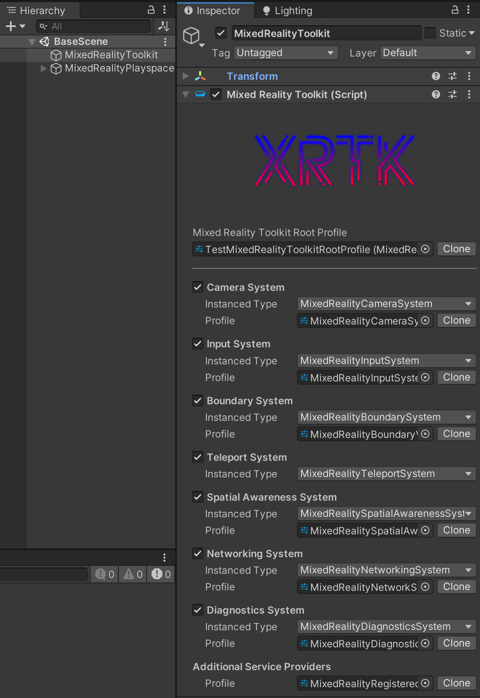
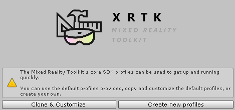
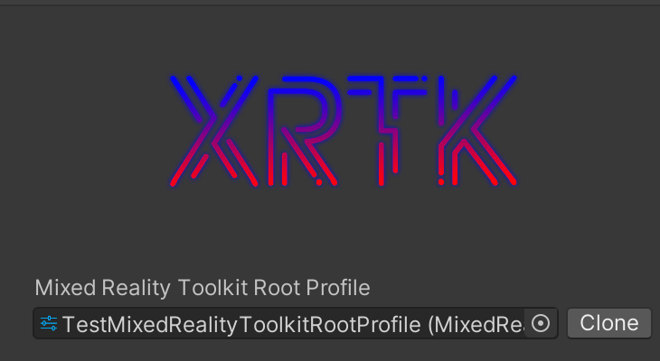

# Configuring your project

> **Note:** We are currently taking feedback on ways to improve the configuration navigation for the Mixed Reality Toolkit.  Please feel free to suggest options in the XRTK Discord channel or raise an [RFI request](https://github.com/XRTK/XRTK-Core/issues/new?assignees=&labels=question&template=request_for_information.md&title=).

## Configuation Profiles

Configuration Profiles are derived from [scriptable objects](https://docs.unity3d.com/ScriptReference/ScriptableObject.html), which are only meant to store data, similar to a json structure but instead in Unity yaml.

The Mixed Reality Toolkit really focused a lot of the [architecure](https://unity3d.com/how-to/architect-with-scriptable-objects) around profiles for different systems, services, and data providers.  Profiles provide these objects with the developer's specific application setup, requirements, and conditions.

> **Note:** All of the Mixed Reality Toolkit's Systems and Services require a profile to run. Data Providers and additional custom services defined by developers may optionally include a profile.

When profiles are created by the Toolkit, they are then placed in the following folder:

> `Assets\XRTK.Generated\CustomProfiles`

This path can be customized by updating your preference in the preferences window.

## Master Configuration Profile

The Mixed Reality Toolkit has a single "master" configuration profile which is referenced on the `MixedRealityToolkit` GameObject in your configured scene.

Double clicking on this profile will select and show the main configuration screen for the Mixed Reality Toolkit:

> The "Default" profiles provided by the Mixed Reality Toolkit are locked by default, so when you view these in the inspector they will appear greyed out.  This is to ensure you always have a common default for any project.  We recommend you create your own profiles (see below) when you need to customize the configuration for your project.

From here you can configure all the core Systems and their individual profile settings:

- [Camera System Settings]()
- [Input System Settings]()
- [Boundary System Settings]()
- [Teleporting System Settings]()
- [Spatial Awareness System Settings]()
- [Diagnostics System Settings]()
- [Additional Service Providers]()

## Customizing your project

When you start a new project, we provide a default configuration with every system and service pre-configured and turned on, for a fully cross-platform project. Developers may choose to further customize this default configuration or approach the project from the opposite end and choose to opt out of everything:

- **Clone & Customize:** Copies all of the default profile settings for you and enables them to be editable.
  > **Note:** This is great for tweaking existing options to fit your edge case needs.
- **Create new profiles:** Start with a blank profile with everything turned off by default.
  > **Note:** This is great for slowly integrating the Mixed Reality Toolkit into an existing project.

Each profile can be individually cloned and customized to your project's needs:

---

### Related Articles

* [Building and running your mixed reality application](https://github.com/XRTK/XRTK-Core/blob/development/articles/00-GettingStarted.md#build-and-play)

---

### [**Raise an Information Request**](https://github.com/XRTK/XRTK-Core/issues/new?assignees=&labels=question&template=request_for_information.md&title=)

If there is anything not mentioned in this document or you simply want to know more, raise an [RFI (Request for Information) request here](https://github.com/XRTK/XRTK-Core/issues/new?assignees=&labels=question&template=request_for_information.md&title=).
