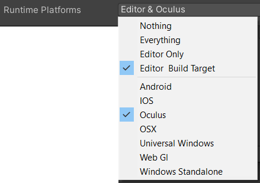
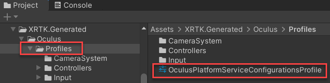

# Mixed Reality Toolkit Platforms

A major component of the Mixed Reality Toolkit is the Platform definitions that was employed to both accurately determine what platforms have been added to the scope of the project and also to determine when a platform is active/running.

## Current Platforms

* [Magic Leap (Lumin)](magicleap.md)
* [Oculus](oculus.md)
* OpenVR - Default runtime platform for Windows Standalone, no special consideration.
* [Ultraleap](ultraleap.md)
* [Windows Mixed Reality (UWP)](windowsmixedreality.md)

## In development

* [etee](etee.md)
* [SteamVR](steamvr.md)
* [WebXR](webxr.md)

## Platform Selection



Wherever configuration can have a variant for platforms, to make the configuration only active when selected platforms are available, the Platform selector is employed.

The list support multiple selections (for cases where a system or profile) can operate for multiple platforms.

The list is dynamic and will update based on which XRTK platforms have been installed and what platforms are supported by the developers Unity installation.

## Platform Identification

To explain how this system basically operates, there is a `Platform` script in the UPM package runtime folder which implements the required interfaces for the platform system, including:

```csharp
    public override bool IsAvailable;
```

`IsAvailable` indicates whether the platform is available at runtime, usually checking for a vendor SDK or other API call which signifies the platform is available.

```csharp
    public override bool IsBuildTargetAvailable
```

`IsBuildTargetAvailable` indicates whether the platform is available at edit time and is a valid build target for the current Unity installation.

It also includes a set of `PlatformOverrides` which help to specify which targets a platform should be available for by default.

## Platform Default Configuration

Included with each platform, a default platform configuration asset is provided to help automatically deploy the necessary configuration to operate a platform, usually including the Camera System and COntroller configuration, but can include others as required.  This is located within the `Profiles` folder of the `XRTK.Generated` folder for the specific platform, for example:



Once selected, the default configuration will appear in the inspector and a `Install Platform Service Configuration` button is available to install the configuration in to your current scene.


> **There must be an existing `MixedRealityToolkit` GameObject in the scene for the configuration installation to be successful.**

---

### [**Raise an Information Request**](https://github.com/XRTK/XRTK-Core/issues/new?assignees=&labels=question&template=request_for_information.md&title=)

If there is anything not mentioned in this document or you simply want to know more, raise an [RFI (Request for Information) request here](https://github.com/XRTK/XRTK-Core/issues/new?assignees=&labels=question&template=request_for_information.md&title=).
