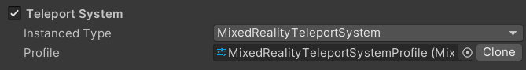
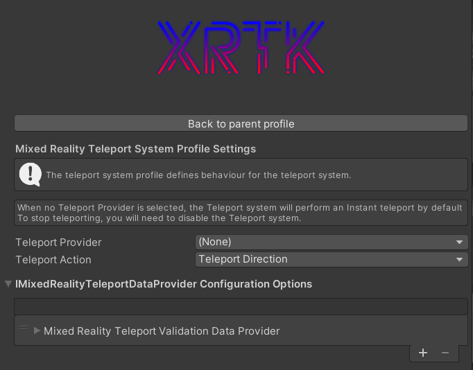
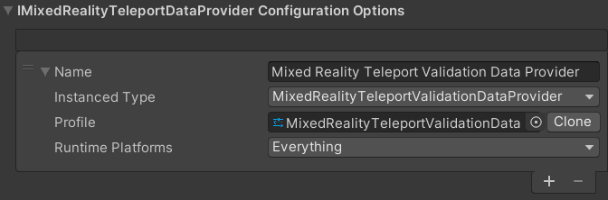
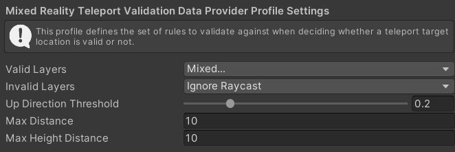

# The Teleport System

The Teleport system is an optional system used to transport users through your Mixed Reality environment.  It has been designed to be flexible and extensible to cope with the varying needs of different projects to locate a player throughout their scenes.

> Please note, this is the initial implementation for teleporting and a significant update will be coming in XRTK 0.3 with a new Locomotion system, which will further extend this systems capabilities.
> [You can read more about it here](https://github.com/XRTK/XRTK-Core/issues/730)

## Mixed Reality Root configuration system

In the Root configuration, the specific implementation for the Teleport system is selected, which defaults to the XRTK implementation for the Teleport system.  In most cases this does not need to be touched, however, advanced users can replace it with their own system if they wish.

## Teleport System platform configuration

The Teleport system for the XRTK allows for different implementations to be utilized for different runtime or build platforms. Each platform provided by the XRTK includes a default Teleport system configuration for that platform which can be customized if you wish:

The configuration holds:

* Teleport Provider - Select the system to be used to transport the user through the environment when a Teleport event is received.
* Teleport Action - The Input Action that the teleport system will used to enact a Teleportation event.  **Please Note** that some action provide additional data and capabilities, such as a Dual-Axis action will enable Teleportation with rotation and the ability to force rotate the view.
* Teleport Data Provider configuration - The data provider list available to the Teleport system, primarily to validate whether a teleport location is valid or not.

> Check out all the [Platforms that are available to configure](../platforms/platforms.md).

## Mixed Reality Teleport data providers

The Teleport system allows for different validation methods to be used based on the capabilities of the target platform, these validation profiles are defined in this data providers list, indicating the teleport validation for the platform and the specific platform the system is applicable for.

## Teleport Validation Profile

The Teleport Validation profile allows you to configure the requirements for a successful teleport, checking the user has selected a valid target by the physics properties or the selection such as physics layers, exclusion layers, max angle and the distance from the origin.  These are used by the teleport system to ensure a teleport event is safe (within the bounds of the project) to perform.

## Further notes

If `None` is selected as the Teleport Provider for the project, then by default, the XRTK will perform an "Instant" teleport when a teleport is successful.  We also provide a "Fading Teleport" method in the SDK for use and reference should you wish to build your own Teleport method.

For the most part, you should not need to alter the Teleport system configuration unless required.

---

### Related Articles

* [Getting Started](../00-GettingStarted.md#getting-started-with-the-mixed-reality-toolkit)
* [Configuration](../02-Configuration.md#getting-started-with-the-mixed-reality-toolkit)
* [XRTK Platforms](../platforms/platforms.md)

---

### [**Raise an Information Request**](https://github.com/XRTK/XRTK-Core/issues/new?assignees=&labels=question&template=request_for_information.md&title=)

If there is anything not mentioned in this document or you simply want to know more, raise an [RFI (Request for Information) request here](https://github.com/XRTK/XRTK-Core/issues/new?assignees=&labels=question&template=request_for_information.md&title=).
