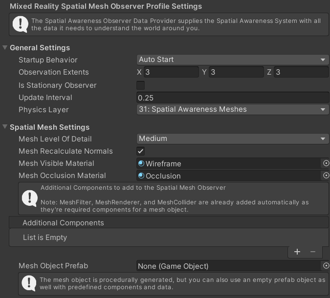

# The Spatial Awareness System

The Spatial Awareness system is primarily used by Augmented Reality devices such as the Hololens 1 & 2 to provide a map or mesh of the surroundings as detailed by the sensors on the device.

> If your project is purely a Virtual Reality (VR) project, you san safely disable this system in the Mixed Reality Root configuration by unchecking the box next to the system.

## Mixed Reality Root configuration system

In the Root configuration, the specific implementation for the Spatial Awareness system is selected, which defaults to the XRTK implementation for the Spatial Awareness system.  In most cases this does not need to be touched, however, advanced users can replace it with their own system if they wish.

## Spatial Awareness System platform configuration

The Spatial Awareness system for the XRTK allows for different implementations to be utilized for different runtime or build platforms. Each platform provided by the XRTK includes a default Spatial Awareness system configuration for that platform which can be customized if you wish:

The configuration holds:

* The startup Mesh Display option, details wether the mesh should be hidden on startup, visible (overlay), Occlude (display over scene) or just as as a collision mesh on top of the real world.
* A Global Mesh Observer Profile (see below)
* A Surface Mesh observer Profile
* A list of data providers / adapters for each implemented platform

> Check out all the [Platforms that are available to configure](../platforms/platforms.md).

## Global Mesh Observer Profile

The mesh Observer profile defines how often the spatial mesh should be updated in the current view and what materials to use to display/update the detected mesh.  It also allows the mesh generation to begin on startup or on command.

## Surface Mesh observer Profile

The surface observer, much like the Mesh observer, allows configuration for the frequency for how often surfaces should be queries from the vendor platform and allows the application of different materials per type of surface detected, from Walls, to floors, ceilings and platforms (tables). Like the mesh observer, this can run on startup or on command.

## Mixed Reality Spatial Awareness data providers

Each platform that provides data to the Spatial Awareness system is defined in this data providers list, indicating the system implementation for the platform and the specific platform the system is applicable for.

You can also provide override configuration for the above options should you wish to, to have the solution behave differently for different platforms.

> Check out all the [Platforms that are available to configure](../platforms/platforms.md).

## Further notes

As indicated, the Spatial Awareness system is only applicable to AR solutions and can be safely disabled for VR projects, if you have an XR solution, the Spatial Awareness system will simply be inoperative due to a lack of data from the platform and can safely be left enabled.

For the most part, you should not need to alter the Spatial Awareness system configuration unless required.

---

### Related Articles

* [Getting Started](../00-GettingStarted.md#getting-started-with-the-mixed-reality-toolkit)
* [Configuration](../02-Configuration.md)
* [XRTK Platforms](../platforms/platforms.md)

---

### [**Raise an Information Request**](https://github.com/XRTK/XRTK-Core/issues/new?assignees=&labels=question&template=request_for_information.md&title=)

If there is anything not mentioned in this document or you simply want to know more, raise an [RFI (Request for Information) request here](https://github.com/XRTK/XRTK-Core/issues/new?assignees=&labels=question&template=request_for_information.md&title=).
