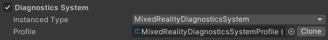
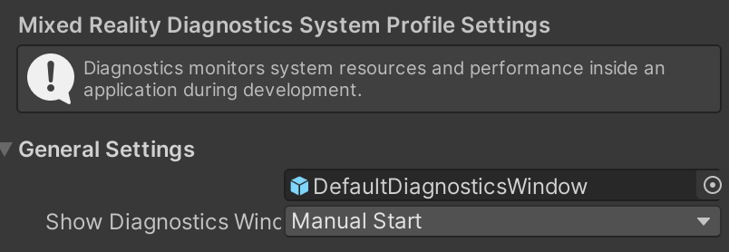

# The Diagnostics System

The Diagnostics system a very useful tool for showing critical diagnostics information in a running scene, it comes in very handy while debugging and sourcing scene based performance issues.

## Mixed Reality Root configuration system

In the Root configuration, the specific implementation for the Diagnostics system is selected, which defaults to the XRTK implementation for the Diagnostics system.  In most cases this does not need to be touched, however, advanced users can replace it with their own system if they wish.

## Diagnostics System platform configuration

The Diagnostics system for the XRTK allows for different instruments to be called to display information in the diagnostics prefab. 

The basic configuration simply identifies the prefab to be displayed in the scene when activated and whether the window is active on startup or called programmatically later.

## Diagnostics Providers

The diagnostic framework is very dynamic allowing different instruments to be added to collect data and customized so that they are run either for all platforms or just specific ones.  New instruments can be added, so long as they derive to the Diagnostics Providers `BaseMixedRealityDiagnosticsDataProvider` implementation.  Simply view the existing implementations for reference.

Additionally, the prefab used will need to provide the capability to display the data, review the default DiagnosticsPrefab for detail.

> For more detail on the [Platforms](08-platform-framework.md) that are available to configure, see the [XRTK Platform Framework](08-platform-framework.md) documentation.

## Further notes

For the most part, you should not need to alter the Diagnostics system configuration unless required, or you wish to manually add a new Diagnostics System instrument manually.

---

### Related Articles

* [XRTK Platform Framework](08-platform-framework.md)

---

### [**Raise an Information Request**](https://github.com/XRTK/XRTK-Core/issues/new?assignees=&labels=question&template=request_for_information.md&title=)

If there is anything not mentioned in this document or you simply want to know more, raise an [RFI (Request for Information) request here](https://github.com/XRTK/XRTK-Core/issues/new?assignees=&labels=question&template=request_for_information.md&title=).
